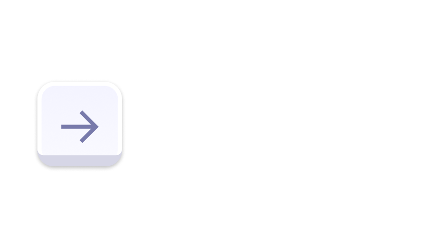
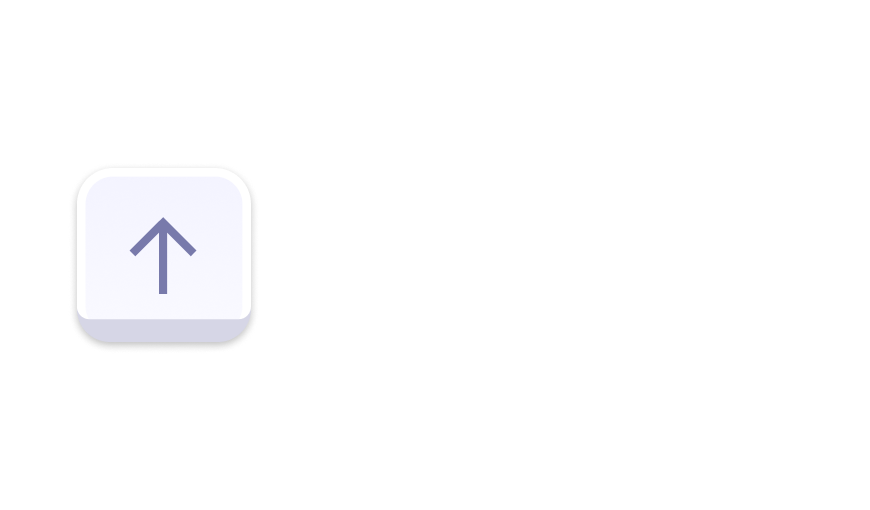
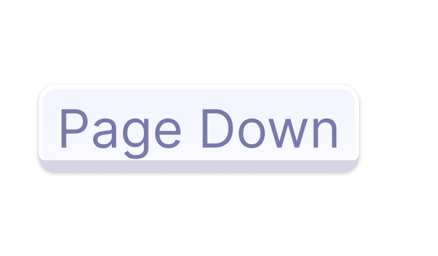
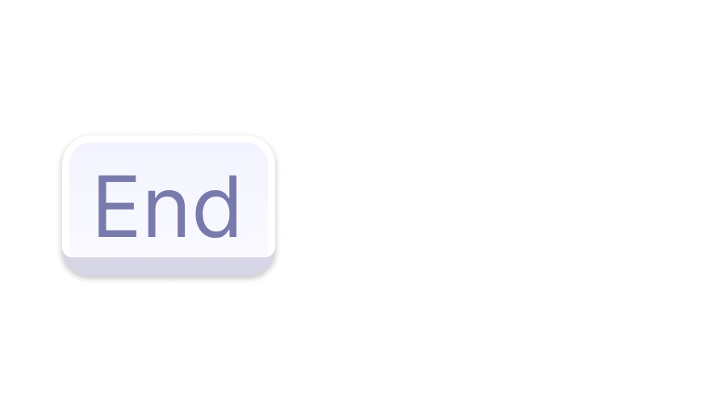
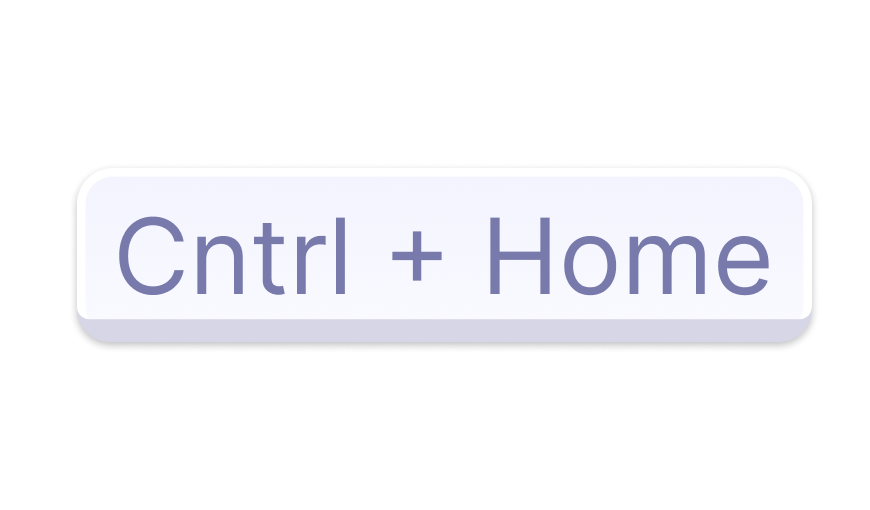
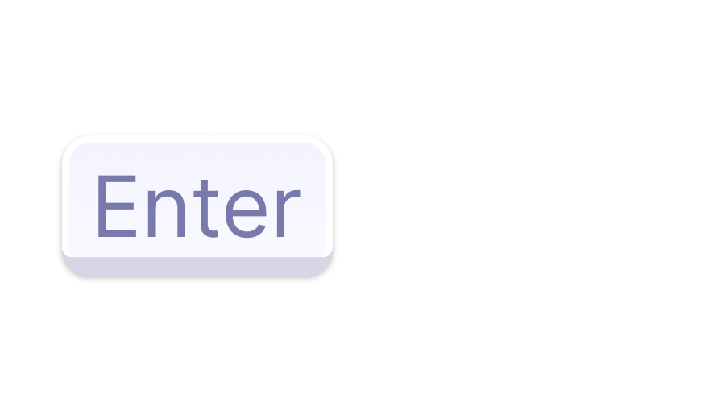

    

<h2 align="center" style="margin-top:-20px">table-keynav</h2>

---

Inspo from AGGrid:

1. Enter will get you inside the first focusable element inside the cell if any (this is only for the header, not the body)
2. Enter will get you to the cell below if you are in a body cell
3. Space in header does nothing
4. Space in cells triggers a click in clickable elements (checkboxes, buttons, etc)
5. CMD+C in cell copies the text in the cell, but this is not mine?!

Also GRID by ARIA specs:
https://w3c.github.io/aria-practices/#grid

### Grid Navigation

| Key                                                       | Description                                                                                                                                                                                                                           |
|-----------------------------------------------------------|:--------------------------------------------------------------------------------------------------------------------------------------------------------------------------------------------------------------------------------------|
|   | Moves focus one cell to the right. If focus is on the right-most cell in the row, focus does not move.                                                                                                                                |
|    | Moves focus one cell to the left. If focus is on the left-most cell in the row, focus does not move.                                                                                                                                  |
|      | Moves focus one cell up. If focus is on the top cell in the column, focus does not move.                                                                                                                                              |
|    | Moves focus one cell down. If focus is on the bottom cell in the column, focus does not move.                                                                                                                                         |
|     | Moves focus down an author-determined number of rows, typically scrolling so the bottom row in the currently visible set of rows becomes one of the first visible rows. If focus is in the last row of the grid, focus does not move. |
|       | Moves focus up an author-determined number of rows, typically scrolling so the top row in the currently visible set of rows becomes one of the last visible rows. If focus is in the first row of the grid, focus does not move.      |
|         | Moves focus to the first cell in the row that contains focus.                                                                                                                                                                         |
|         | Moves focus to the last cell in the row that contains focus.                                                                                                                                                                          |
|  | Moves focus to the first cell in the first row.                                                                                                                                                                                       |
|  | Moves focus to the first cell in the last row.                                                                                                                                                                                        |
|       | Disables grid navigation and focuses on the first focusable element in the cell. If there are no focusable elements in the cell.                                                                                                      |

### Cell Navigation

> **Note**
> WTF (What the focus) is going on. There is no standardised way to know what is actually focusable in the web.
> To comply with this lib and work properly, you need to add a `tabindex` attribute explicitly to the elements you want to be focusable, inside a cell, except for `input` and `textarea` elements.

| Key                                                                                                              | Description                                                                                                                                                                                                                |
|------------------------------------------------------------------------------------------------------------------|:---------------------------------------------------------------------------------------------------------------------------------------------------------------------------------------------------------------------------|
|                                                             | Restores grid navigation.                                                                                                                                                                                                  |
|   | If the cell contains multiple widgets, moves focus to the next widget inside the cell, optionally wrapping to the first widget if focus is on the last widget. Otherwise, passes the key event to the focused widget.      |
|      | If the cell contains multiple widgets, moves focus to the previous widget inside the cell, optionally wrapping to the first widget if focus is on the last widget. Otherwise, passes the key event to the focused widget.  |

> The below keystrokes are supported natively by browsers, so this library will not implement any handling

- Tab: moves focus to the next widget in the grid. Optionally, the focus movement may wrap inside a single cell or within the grid itself. (As described, there should be no trap focus inside a grid cell).
- Shift + Tab: moves focus to the previous widget in the grid. Optionally, the focus movement may wrap inside a single cell or within the grid itself.

---

### TODO

- [x] : Fix header not working
- [x] : Add Needle table example
- [ ] : Add tests
- [ ] : Fix filtering not working
- [x] : Create cool logo and keyboard keys
- [ ] : Add docs
- [ ] : Add individual hooks to handle granular actions, and leave a generic table hook to handle simple tables. Like `widgetKeydown`?
- [ ] : Add framework wrappers, for react for example

### Known issues 🐝

1. Vertical navigation needs to be a bit smarter: [video](https://share.cleanshot.com/W7QBb0NV)
2.

### Useful links 📚

1. https://github.com/jsx-eslint/eslint-plugin-jsx-a11y/blob/main/docs/rules/no-noninteractive-element-interactions.md
2. https://www.w3.org/WAI/ARIA/apg/patterns/grid/
3. https://www.ag-grid.com/example/
4. https://developer.mozilla.org/en-US/docs/Web/API/UI_Events/Keyboard_event_key_values
5. https://github.com/ETSOO/Shared/blob/master/src/Keyboard.ts
